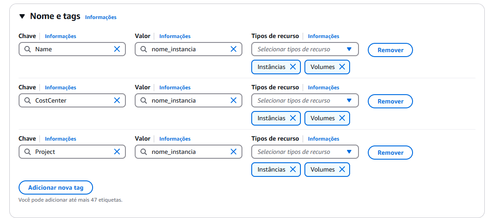
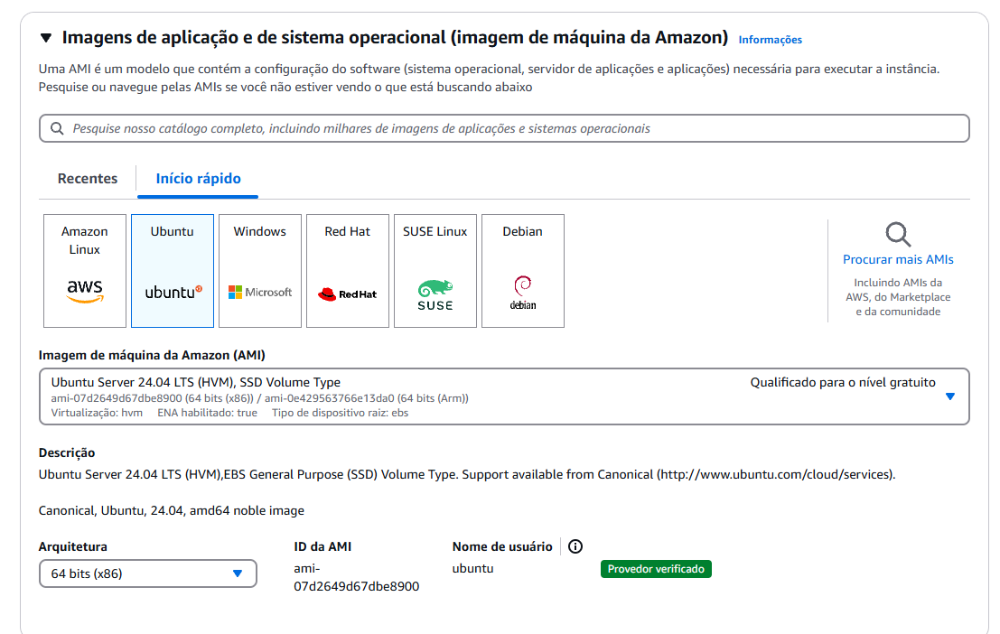
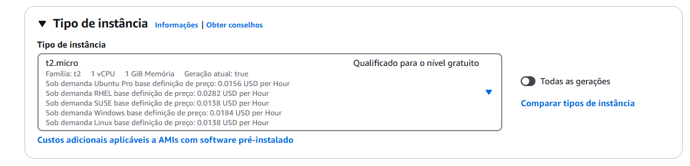
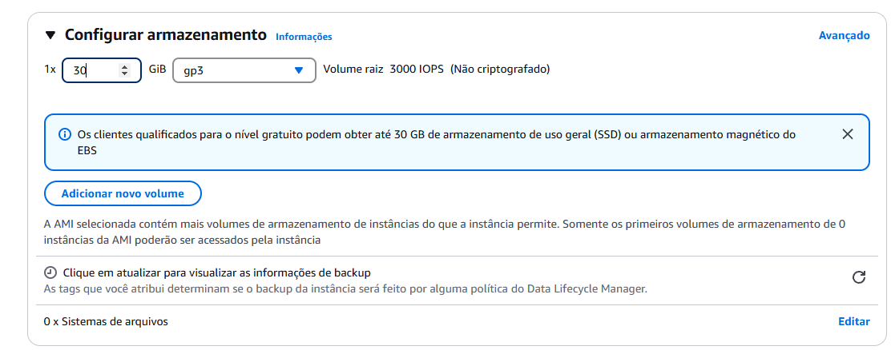
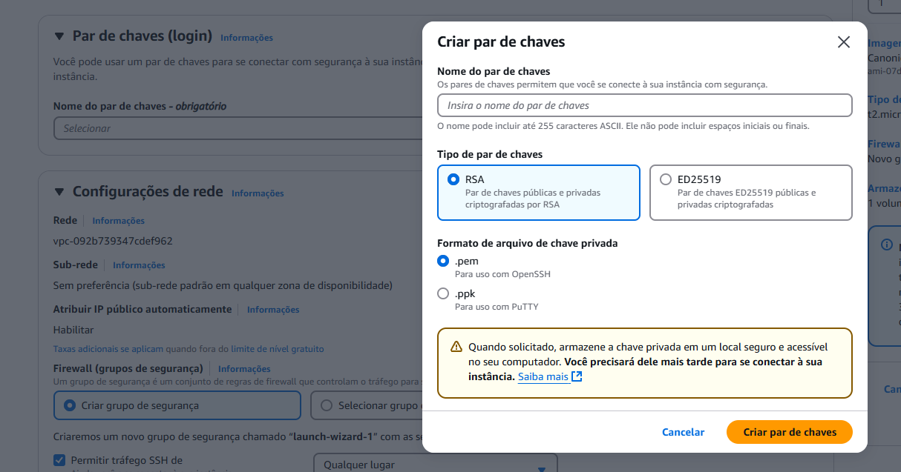

# Configuração da Instância EC2 para a API

## 1. Criando a Instância EC2

### Passo 1: Acesse o console da AWS para criar as instâncias
1. Acesse o [AWS Management Console](https://aws.amazon.com/console/).
2. No menu de serviços, selecione **EC2**.
3. Clique em **Executar Instância**.

### Passo 2: Nomes e tags 
1. Clique em "Adicionar mais tags"
2. No primeiro campo escreva "Name", no valor "teste" ou qualquer outro nome e nos tipos de recursos selecione a opção "Volumes"
3. No segundo campo escreva "CostCenter", no valor "teste" ou qualquer outro nome e nos tipos de recursos selecione a opção "Volumes"
4. No segundo campo escreva "Project", no valor "teste" ou qualquer outro nome e nos tipos de recursos selecione a opção "Volumes"


### Passo 3: Escolha a Imagem da Máquina (AMI)

1. Selecione **Ubuntu Server 22.04 LTS** (ou a versão mais recente estável para sua aplicação).
2. Clique em **Selecionar**.


### Passo 4: Escolha o Tipo da Instância

1. Para ambiente de desenvolvimento/teste, escolha **t2.micro** (1 vCPU, 1GB RAM - gratuito para contas elegíveis).
2. Para produção, selecione um tipo adequado conforme a necessidade.


### Passo 5: Configurar a rede 
1. Selecione o VPC que foi criado anteriomente  
2. Selecione a sub-rede que possuir public dentro no nome, exemplo: {nome da sua vpc}-subnet-**pubclic**
3. Selecione a opção de "Habilitar" na opção de Atribuir o IP público
4. Selecione a opção  "Selecionar grupo existente"
5. Selecione o grupo de segurança que foi criado anteriormente
[imagem_config](imagens\print11_s3.png)

### Passo 6: Adicionar Armazenamento

1. O padrão é **8GB** de SSD (EBS), ajuste conforme necessário.
2. Clique em **Avançar**.



### Passo 7: Criar e Associar Chave SSH

1. Escolha "Criar novo par de chaves".
2. Baixe o arquivo `.pem` e guarde-o em um local seguro.
3. Clique em **Executar Instância**.


### Passo 8: Conectar IP da API na aplicação WEB
1. Nas instâncias, clique na instância da API 
2. Na tela, vai estar mostrando o resumo da instância 
3. Copie o endereço IPV4 público 
4. Acesse a aplicação WEB -> src -> services -> api.ts
5. Na baseURL substitua com o IPV4 que foi copiado 
```sh
baseURL: 'http://13.56.58.75:3000'
```

---

## 2. Conectando-se à Instância via SSH
1. No terminal, navegue até a pasta onde está sua chave SSH.
2. Execute:
   ```sh
   ssh -i "seu-arquivo.pem" ubuntu@seu-ip-publico
   ```
   - Substitua `seu-arquivo.pem` pelo caminho correto do arquivo.
   - Substitua `seu-ip-publico` pelo IP da sua instância.

---

## 3. Configurando o Ambiente

### Passo 1: Atualizar o sistema
```sh
sudo apt update && sudo apt upgrade -y
```

### Passo 2: Instalar o Docker
```sh
sudo snap install docker
```

### Passo 3: Configurar chave SSH para acesso ao GitHub
```sh
ssh-keygen -t rsa -b 4096 -C "seu-email@example.com"
cat ~/.ssh/id_rsa.pub
```

### Passo 4: Adicionar a chave SSH ao GitHub
1. Acesse **GitHub > Settings**.
2. Clique em **SSH and GPG keys**.
3. Clique em **New SSH key**.
4. Nomeie a chave e cole a chave gerada.
5. Clique em **Add SSH key**.

### Passo 5: Clonar o repositório do projeto
```sh
git clone git@github.com:ViniciusVezono/D03_AWS_FULLSTACK_NOV24.git
```

### Passo 6: Entrar na pasta do projeto
```sh
cd D03_AWS_FULLSTACK_NOV24
```

### Passo 7: Entrar na pasta da API
```sh
cd GreenSphere-api
```

### Passo 8: Inicializar o container da API
```sh
sudo docker-compose up -d api
```

---

## Agora sua API está rodando na instância EC2 da AWS!

