# Configuração da Instância EC2 para a API

## 1. Criando a Instância EC2

### Passo 1: Acesse o console da AWS para criar sua VPC
1. No menu de pesquisa, procure por VPC
2. Assim que entrar na aba de VPC's, clique no botão de "Criar VPC"
3. Selecione a opção "VPC e muito mais"
4. Digite um nome para a sua VPC
5. Ao final da tela, clique em “Criar VPC” para finalizar o processo de criação
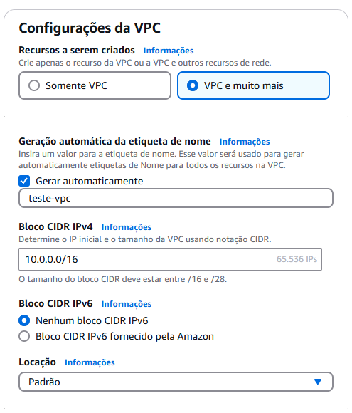

### Passo 2: Acesse o Console da AWS para criar o grupo de segurança
1. No menu de pesquisa, procure "Grupo de Segurança"
2. Clique na opção "Criar grupo de segurança"
3. Preencha os seguintes campos com o nome que preferir. 
4. Selecione a opção da VPC que foi criada anteriomente.
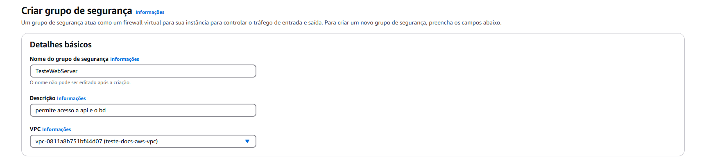
5. No fim a sua tela estára assim:
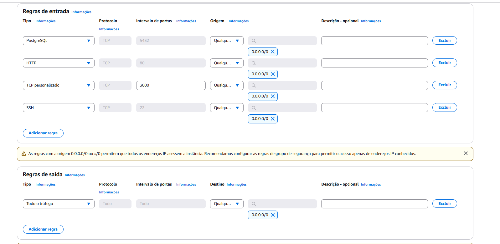
6. Ao final da tela, clique em "Criar grupo de segurança"

### Passo 3: Acesse o console da AWS para criar as instâncias
1. Acesse o [AWS Management Console](https://aws.amazon.com/console/).
2. No menu de serviços, selecione **EC2**.
3. Clique em **Executar Instância**.

### Passo 4: Nomes e tags 
1. Clique em "Adicionar mais tags"
2. No primeiro campo escreva "Name", no valor "teste" ou qualquer outro nome e nos tipos de recursos selecione a opção "Volumes"
3. No segundo campo escreva "CostCenter", no valor "teste" ou qualquer outro nome e nos tipos de recursos selecione a opção "Volumes"
4. No segundo campo escreva "Project", no valor "teste" ou qualquer outro nome e nos tipos de recursos selecione a opção "Volumes"
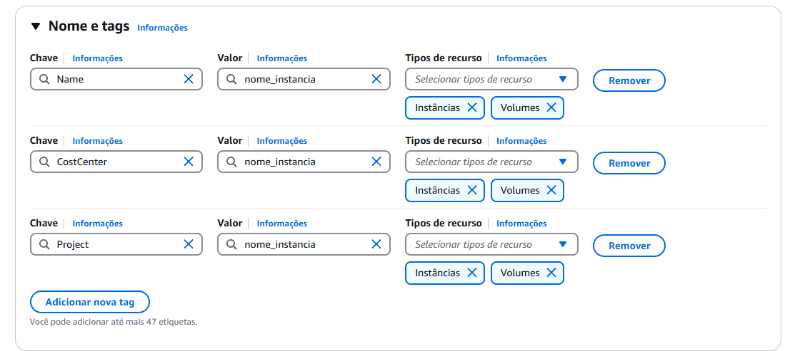

### Passo 5: Escolha a Imagem da Máquina (AMI)

1. Selecione **Ubuntu Server 22.04 LTS** (ou a versão mais recente estável para sua aplicação).
2. Clique em **Selecionar**.
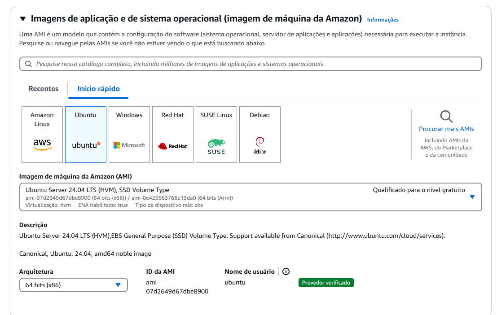

### Passo 6: Escolha o Tipo da Instância

1. Para ambiente de desenvolvimento/teste, escolha **t2.micro** (1 vCPU, 1GB RAM - gratuito para contas elegíveis).
2. Para produção, selecione um tipo adequado conforme a necessidade.
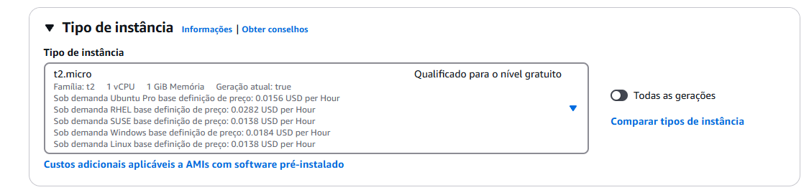

### Passo 7: Configurar a rede 
1. Selecione o VPC que foi criado anteriomente  
2. Selecione a sub-rede que possuir public dentro no nome, exemplo: {nome da sua vpc}-subnet-**pubclic**
3. Selecione a opção de "Habilitar" na opção de Atribuir o IP público
4. Selecione a opção  "Selecionar grupo existente"
5. Selecione o grupo de segurança que foi criado anteriormente


### Passo 8: Adicionar Armazenamento

1. O padrão é **8GB** de SSD (EBS), ajuste conforme necessário.
2. Clique em **Avançar**.
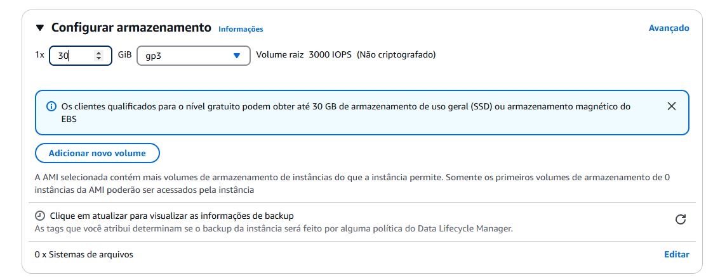


### Passo 9: Criar e Associar Chave SSH

1. Escolha "Criar novo par de chaves".
2. Baixe o arquivo `.pem` e guarde-o em um local seguro.
3. Clique em **Executar Instância**.
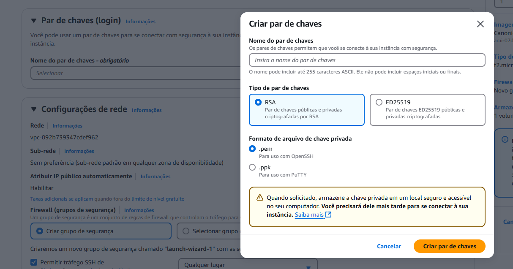

### Passo 10: Conectar IP da instância na aplicação
1. No menu de opções do EC2, clique em instâncias 
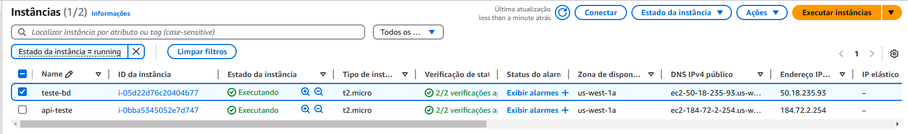
2. Clique na instância que foi criada para o banco de dados
3. Copie o IPV4 público 
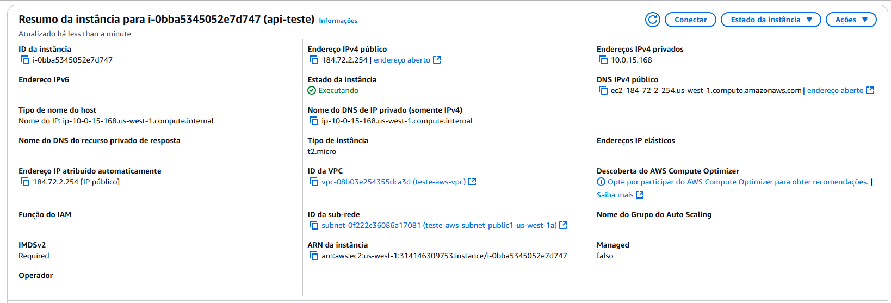
4. Acesse a aplicação e adicione o IPV4 público na pasta .env dentro de GreenSphere-api
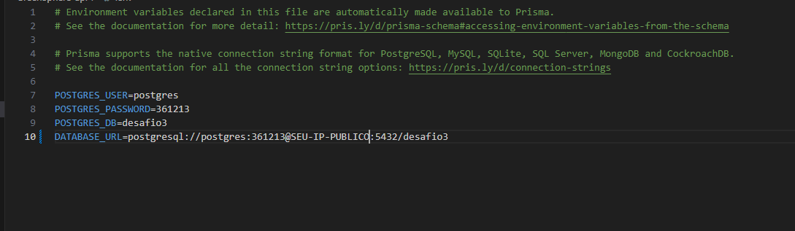

---

## 2. Conectando-se à Instância via SSH

### Passo 1: DNS Pública 
1. Vá na instância que acabou de criar e clique botão "Conectar"
2. Clique na aba de "Cliente SSH"
3. Copie a sua DNS pública

### Passo 2: No terminal, navegue até a pasta onde está sua chave SSH.

1. Execute o comando:
   
   ```sh
   ssh -i "seu-arquivo.pem" ubuntu@seu-ip-publico
   ```
   
   - Substitua `seu-arquivo.pem` pelo caminho correto do arquivo.
   - Substitua `seu-ip-publico` pelo IP da sua instância.
   
2. Agora você está conectado à sua instância EC2!

---

## 3. Configurando o Ambiente

### Passo 1: Atualizar o sistema
   ```sh
   sudo apt update && sudo apt upgrade -y
   ```

### Passo 2: Instalar o Docker
   ```sh
   sudo snap install docker
   ```

### Passo 3: Configurar chave SSH para acesso ao GitHub
   ```sh
   ssh-keygen -t rsa -b 4096 -C "seu-email@example.com"
   cat ~/.ssh/id_rsa.pub
   ```

### Passo 4: Adicionar a chave SSH ao GitHub
1. Acesse **GitHub > Settings**.
2. Clique em **SSH and GPG keys**.
3. Clique em **New SSH key**.
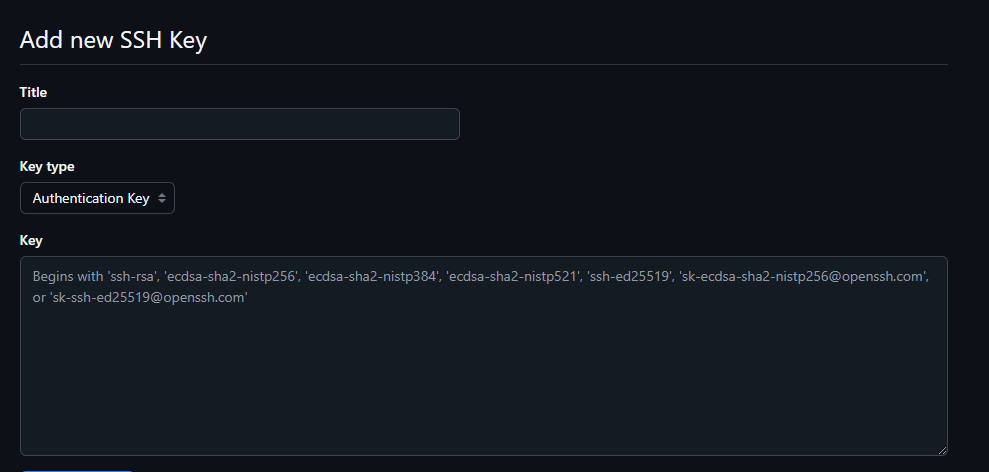
4. Nomeie a chave e cole a chave gerada.
5. Clique em **Add SSH key**.


### Passo 5: Clonar o repositório do projeto
   ```sh
   git clone git@github.com:ViniciusVezono/D03_AWS_FULLSTACK_NOV24.git
   ```

### Passo 6: Entrar na pasta do projeto
   ```sh
   cd D03_AWS_FULLSTACK_NOV24
   ```

### Passo 7: Entrar na pasta da API
   ```sh
   cd GreenSphere-api
   ```

### Passo 8: Inicializar o container do banco de dados
   ```sh
   sudo docker-compose up -d postgres
   ```

### Passo 9: Verificar os containers em execução
   ```sh
   sudo docker ps
   ```

Se tudo estiver configurado corretamente, seu banco de dados estará pronto para ser utilizada!

---

## Agora sua API está rodando na instância EC2 da AWS!

